# 경복궁 리뷰 크롤링

경복궁 리뷰를 여러 사이트에서 수집하는 프로젝트입니다.

## 데이터

| 사이트 | 링크 | 파일 | 리뷰 개수 |
|---|---|---|---:|
| 카카오맵 | https://place.map.kakao.com/18619553 | `reviews_kakao.csv` | 500개 |
| 트립어드바이저 | https://www.tripadvisor.co.kr/Attraction_Review-g294197-d324888-Reviews-Gyeongbokgung_Palace-Seoul.html | `reviews_트립어드바이저.csv` | 500개 |
| 구글맵스 | https://www.google.com/maps/search/%EA%B2%BD%EB%B3%B5%EA%B6%81?entry=ttu&g_ep=EgoyMDI2MDcyMi4wIKXMDSoASAFQAw%3D%3D | `reviews_GoogleMaps.csv` | 500개 |


각 CSV 파일은 다음 컬럼을 포함합니다.

| 컬럼 | 내용 |
|---|---|
| `rating` | 별점 |
| `date` | 작성 날짜 |
| `review` | 리뷰 내용 |

결과 파일은 `database` 폴더에 저장됩니다.

```text
database/
├── reviews_kakao.csv
├── reviews_트립어드바이저.csv
└── reviews_GoogleMaps.csv
```

## 설치

```bash
python -m pip install -r requirements.txt
```

## 실행

카카오맵 크롤러:

```bash
python -m review_analysis.crawling.main -o database -c kakao
```
트립어드바이저 크롤러:

```bash
python -m review_analysis.crawling.main -o database -c tripadvisor
```
구글맵스 크롤러:

```bash
python -m review_analysis.crawling.main -o database -c googlemaps
```

전체 크롤러:

```bash
python -m review_analysis.crawling.main -o database --all
```

## 타입 검사

```bash
python -m mypy review_analysis utils
```

# [4회차] EDA&FE, 시각화 과제

## 1. EDA

### 1.1 카카오맵 리뷰 분석

#### 1.1.1 별점 분포

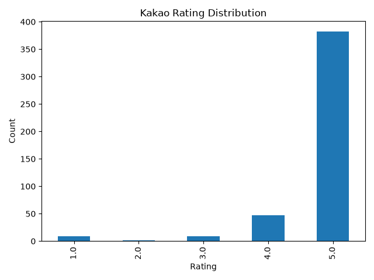

별점은 5점에 매우 집중되어 있고 4점이 그다음으로 많다. 1~3점 리뷰는 상대적으로 매우 적어 전체적으로 높은 별점에 치우친 분포를 보인다. 낮은 별점 리뷰는 개수가 적어 이상치처럼 보일 수 있지만 실제로 부정적인 평가일 수 있으므로 제거 대상보다는 별도로 내용을 확인할 필요가 있다.

#### 1.1.2 리뷰 길이 분포

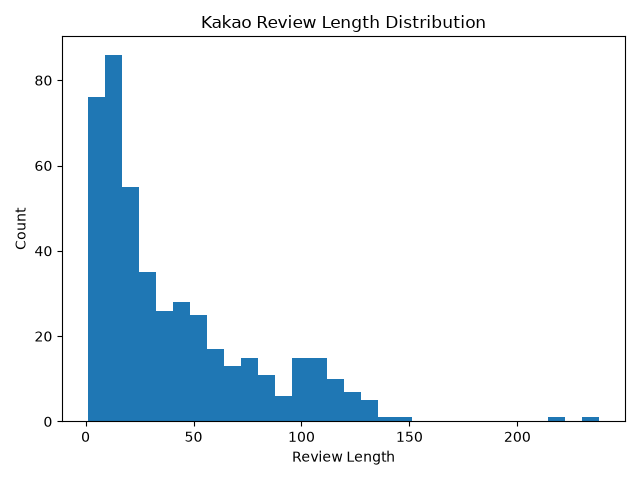

대부분의 리뷰는 비교적 짧은 길이에 집중되어 있으며 리뷰 길이가 길어질수록 개수가 급격히 감소하는 오른쪽 꼬리가 긴 분포를 보인다. 약 700자, 1100자, 1800자 정도의 매우 긴 리뷰가 이상치 후보로 나타난다. 다만 실제로 상세하게 작성된 리뷰로 생각되어 원문을 확인해야 한다.

#### 1.1.3 월별 리뷰 수 변화

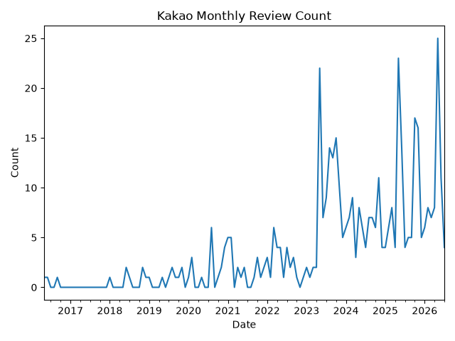

과거에는 월별 리뷰 수가 적었지만 2021년 이후 점차 증가했으며 2023년 이후에는 리뷰 수가 크게 늘어난 모습을 보인다. 일부 월에는 리뷰 수가 갑자기 증가하거나 0에 가까워지는 구간이 존재한다. 이러한 급격한 변화는 이상치 후보이지만 여행 성수기와 비성수기의 영향일 수 있다고 생각된다.

---

### 1.2 트립어드바이저 리뷰 분석

#### 1.2.1 별점 분포

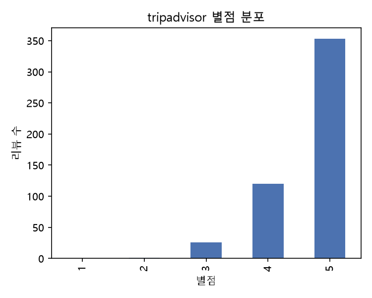

별점은 5점(353개)에 압도적으로 집중되어 있고 4점(120개)이 그다음으로 많다. 3점은 26개, 2점은 1개에 불과하며 1점 리뷰는 존재하지 않는다. 전반적으로 매우 긍정적인 평가에 치우친 분포를 보이며, 별점 범위(1~5점)를 벗어난 이상치는 발견되지 않았다.

#### 1.2.2 리뷰 길이 분포

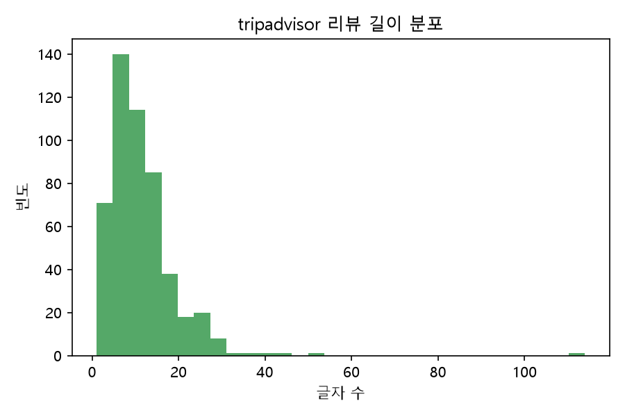
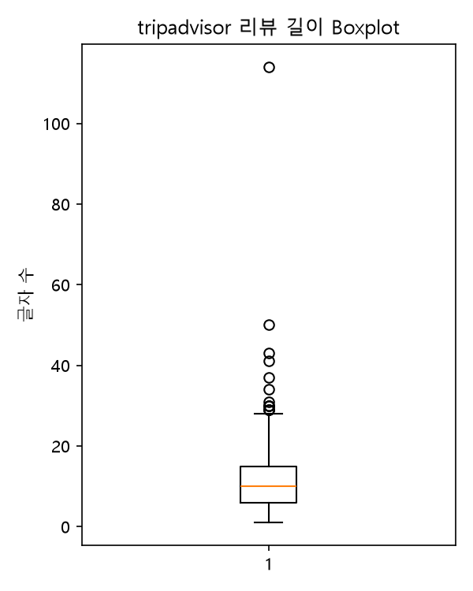

평균 리뷰 길이는 약 11.4자로 매우 짧으며, 대부분 한두 문장의 제목형 리뷰로 구성되어 있다. 최대 길이는 114자이고, IQR 기준으로 텍스트 길이 이상치는 13개, 그 중 1~2자짜리 극단적으로 짧은 리뷰가 20개 존재한다. 다른 사이트와 달리 리뷰가 짧은 편이라 상한선보다는 하한선(초단문 리뷰) 쪽 이상치 처리가 더 중요했다.

#### 1.2.3 월별 리뷰 수 변화

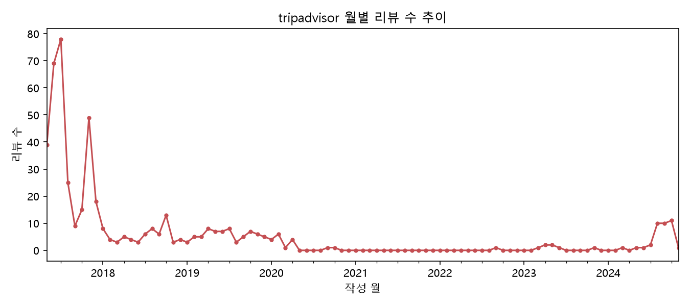

2017~2018년에 리뷰가 집중적으로 작성되었으며 이후 점차 감소해 2020~2023년에는 매우 적은 수의 리뷰만 남아있다. 2024년 들어 다시 소폭 증가하는 모습을 보인다. 날짜 파싱 실패나 미래/2000년 이전 날짜와 같은 이상치는 발견되지 않았다.

---

### 1.3 구글맵 리뷰 분석

#### 1.3.1 별점 분포

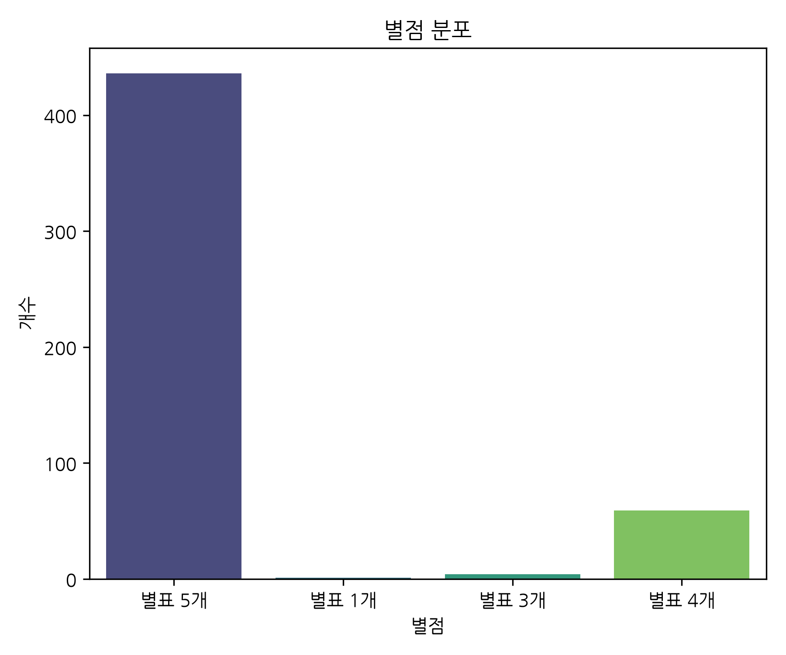
별점은 5점이 436개로 압도적으로 많고 4점이 59개로 다음으로 많다. 1~3점에는 5개의 리뷰밖에 없을정도로 적었다. 낮은 별점 리뷰는 개수가 적어 이상치처럼 보일 수 있지만 실제로 부정적인 평가일 수 있으므로 제거 대상보다는 별도로 내용을 확인할 필요가 있다.


#### 1.3.2 리뷰 길이 분포

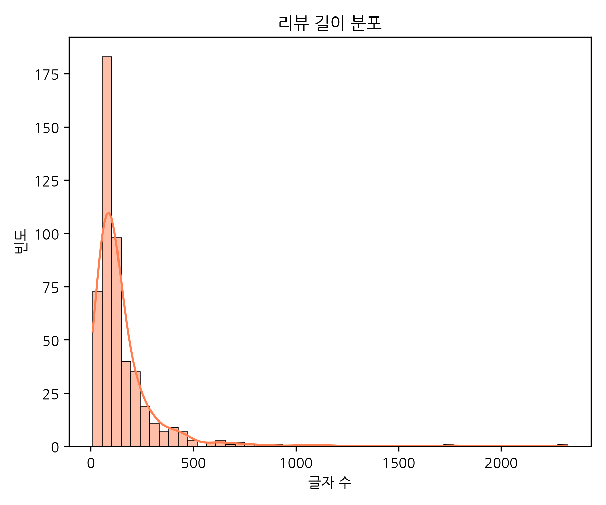
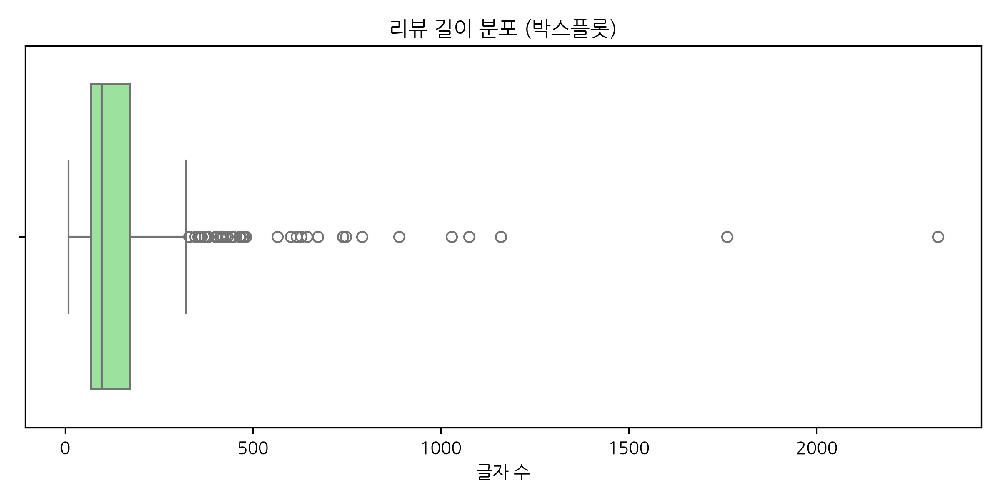

평균 리뷰 길이는 약 150자 정도이고 사분위수 25%가 약 69자, 75%가 169자로 평균 주변에 많이 분포되어 있으나 최대 리뷰 길이가 2212자일 정도로 500자가 넘는 평균에서 오른쪽으로 많이 벗어난 값들도 존재했다. 이 리뷰들은 이상치 후보였으나 실제로 확인해보니 대부분이 아주 상세하게 적어놓은 리뷰라서 이상치로 분류하지 않는 것으로 결정했다.

#### 1.3.3 연도별 리뷰 수 변화

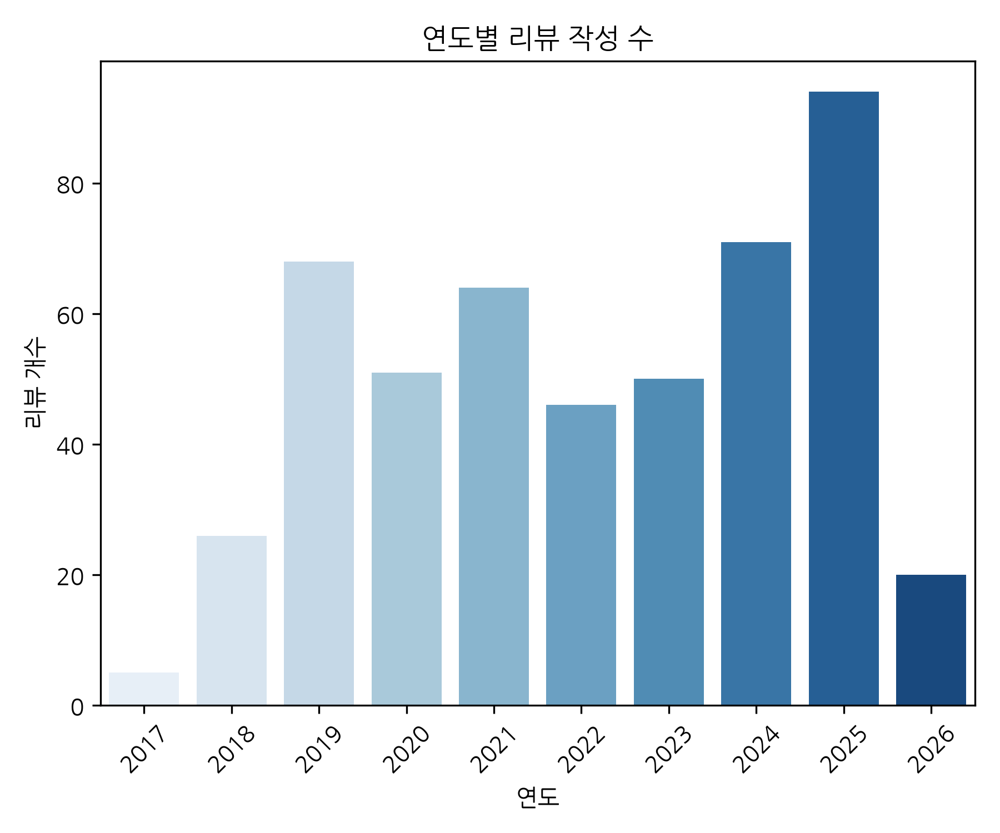
구글은 리뷰에 정확한 날짜가 표시되어있지 않고 'n개월전', 'n년전' 형태로 표시되어 있어 연도별 리뷰 수 분포를 확인해보았다. 2025년에 리뷰 수가 가장 많았으며 2017년, 2018년, 2026년을 제외한 연도들은 모두 40개 이상의 리뷰가 고루 작성되었다.


## 2.전처리/FE
### 2.1 공통
1. 결측치 처리 
- 자연어 분석의 핵심인 리뷰 내용(review)이나 작성 날짜(date)가 누락된 데이터는 분석에 활용할 수 없으므로 행 자체를 제거했다.
- 별점 데이터에 결측치가 존재하는 경우, 전체 데이터의 왜곡을 최소화하기 위해 '평균 별점'을 반올림한 정수값으로 대체했다.

2. 이상치 처리
- 1글자로 이루어진 리뷰(예: '.','ㅋ'): 문맥적 정보가 없는 텍스트 이상치로 판단하여 제거했다.
- 글자 수가 매우 많은 리뷰: 먼저 이러한 리뷰들이 모두 스팸, 도배, 광고가 아님을 확인했다. 이러한 리뷰는 이상치로 보기보다는 오히려 상세하고 구체적인 경우가 많아 가치 있는 데이터로 판단내려 제거하지 않았다.   

3. 텍스트 데이터 전처리
- 이모티콘과 불필요한 특수문자 제거: 이모티콘과 불필요한 특수문자는 텍스트 벡터화할 때 차원을 쓸데없이 크게 만들고 시각화하는 과정에서 폰트가 깨지거나 에러를 유발할 수 있기에 지우기로 결정했다. 정규표현식(RegEx)을 사용하여 한글, 영문, 숫자, 기본 구두점(.,?!), 공백을 제외한 모든 불필요한 특수문자와 그림 이모티콘을 텍스트에서 완전히 제거했다. 
- 공백 정제: 연속된 공백을 단일 공백으로 줄이고 문자열 양끝의 불필요한 띄어쓰기를 잘라내어 분석 모델이 단어를 정확히 인식하도록 정제했다. 정제 후 텍스트가 완전히 비어버린 행도 제거했다.

4. 파생변수 생성 
- 리뷰 글자 수: 정제된 리뷰 텍스트의 총 글자 수를 계산하여 새로운 파생변수로 추가했다. 이 변수는 사용자 리뷰의 정성적 깊이를 유추하는 지표이자 이상치를 필터링하기 위한 척도로 활용했다.

5. 텍스트 벡터화
- TF-IDF 적용: 추후 키워드 빈도 분석 및 감정 분석을 수행하기 위해 정제된 리뷰 텍스트를 숫자로 이루어진 Sparse Matrix로 변환하는 TF-IDF 방식을 적용했다.
- 피처 최적화 및 저장: 메모리 효율과 학습 속도를 고려해 출현 빈도 기준 최상위 1,000개의 단어만 피처로 추출했다. 변환된 행렬과 벡터라이저는 .pkl 확장자(joblib)로 저장하여 즉시 분석에 사용할 수 있도록 했다. 

### 2.2 카카오맵 리뷰 전처리
- 텍스트 데이터 전처리 
1. 'YYYY.MM.DD' 형태의 날짜 데이터를 이후 원활한 비교분석을 위해 'YYYY-MM-DD' 형태로    표준화했다.

### 2.3 트립어드바이저 리뷰 전처리
- 텍스트 데이터 전처리 
1. 리뷰 내용의 컬럼명을 'content'에서 'review'로 통일해주었다.
2. 'YYYY년 MM월 DD일' 형태의 날짜 데이터를 이후 원활한 비교분석을 위해 'YYYY-MM-DD' 형태로 표준화했다.
- 별점 이상치 처리
3. 1~5점 범위를 벗어난 별점 값은 결측 처리한 뒤, 공통 규칙과 동일하게 평균 별점을 반올림한 값으로 대체했다.
- 날짜 이상치 처리
4. 2000년 이전 또는 크롤링 시점 이후(미래) 날짜는 이상치로 판단하여 제거했다.
- 파생변수 생성
5. 작성 요일(day_of_week)을 추가로 생성하여 시계열 비교분석 시 요일별 리뷰 패턴을 분석할 수 있도록 했다.

### 2.4 구글맵 리뷰 전처리

- 텍스트 데이터 전처리 
1. 크롤링 된 'n달 전', 'n년 전' 형태의 문자열 날짜를 크롤링 기준일(2026-07-27)을 기준으로 계산하여 시계열 분석이 가능한 형태인 'YYYY-MM-DD' 형식의 날짜로 일괄 변환했다.
2. ‘별표 n개’ 형태의 문자열 데이터를 'n' 형태의 int 데이터로 변환했다. 

## 3. 사이트별 비교분석 및 시각화

### 3.1 사이트별 리뷰 길이 비교

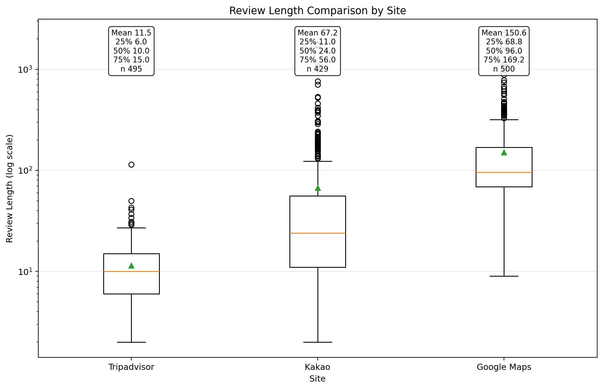

사이트별 리뷰 길이를 비교한 결과 구글맵의 리뷰가 가장 길고 카카오맵, 트립어드바이저 순으로 나타났다. 특히 트립어드바이저의 리뷰 길이가 다른 사이트보다 현저히 짧아 수집 데이터를 확인해보니 리뷰 본문이 아닌 제목만 수집된 것을 확인하였다. 시간상 모든 데이터를 다시 수집하지는 못했지만, 이번 비교분석을 통해 트립어드바이저의 크롤링 결과가 리뷰 본문을 완전히는 반영하지 못했다는 문제를 발견할 수 있었다. 따라서 트립어드바이저의 결과는 사이트 이용자의 실제 리뷰 작성 성향보다는 크롤링 방식의 영향을 받은 것으로 판단된다.

구글맵은 다른 사이트보다 리뷰 길이가 전반적으로 길게 나타났다. 구글맵은 외국인 이용자의 리뷰가 많, 외국어 리뷰의 번역문이 함께 수집된 경우가 있어 리뷰 길이가 증가했을 가능성이 있다. 다만 이는 데이터에서 관찰된 특징을 바탕으로 한 추측으로 닉네임 혹은 해당 프로필의 국적을 확인하는 방향으로 확인해볼 여지가 있다.

### 3.2 사이트별 월별 리뷰 수 비교

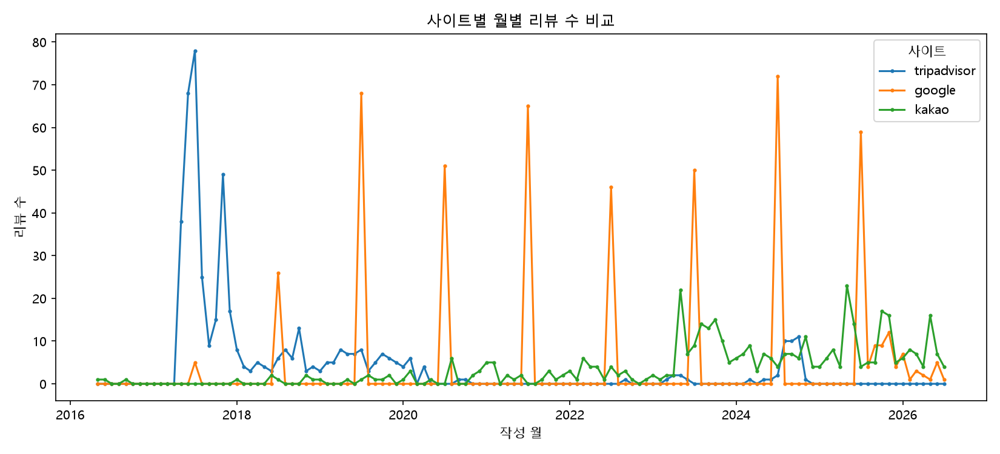

트립어드바이저는 2017~2018년에 리뷰가 집중적으로 작성된 이후 점차 감소했다가 2024년 들어 다시 소폭 증가하는 추세를 보인다. 이는 코로나19로 인한 여행 감소 시기(2020~2022년)와도 맞물려 보이는데, 실제로 이 구간에 카카오맵과 트립어드바이저 모두 리뷰 수가 눈에 띄게 줄어든 모습이 나타난다. 반면 카카오맵은 2023년 이후 리뷰 수가 크게 증가하는 추세를 보이는데, 이는 국내 여행 수요 회복과 함께 카카오맵 리뷰 작성 기능의 접근성이 높아진 영향으로 추정된다.

구글맵 데이터는 매년 7월 27일(크롤링 기준일)에 리뷰가 뾰족하게 몰려있는 패턴이 나타난다. 이는 실제 리뷰 작성 패턴이 아니라 원본 크롤링 데이터 자체에 정확한 작성일이 존재하지 않고, '3년 전', '5년 전'과 같은 상대적 표현으로만 기록되어 있기 때문이다. 이를 절대 날짜로 변환하는 과정에서 정확한 월/일 정보 없이 크롤링 기준일(2026-07-27)로부터 n년을 그대로 빼는 방식으로 계산할 수밖에 없었고, 그 결과 실제로는 1년 내내 고르게 분포했을 리뷰들이 매년 같은 하루(7월 27일)로 뭉쳐 보이는 것이다. 따라서 구글맵의 월별 추이는 원본 데이터의 한계로 인해 참고용으로만 해석해야 하며, 정확한 시계열 비교는 트립어드바이저와 카카오맵 중심으로 보는 것이 적절하다.

### 3.3 사이트별 주요 키워드 비교

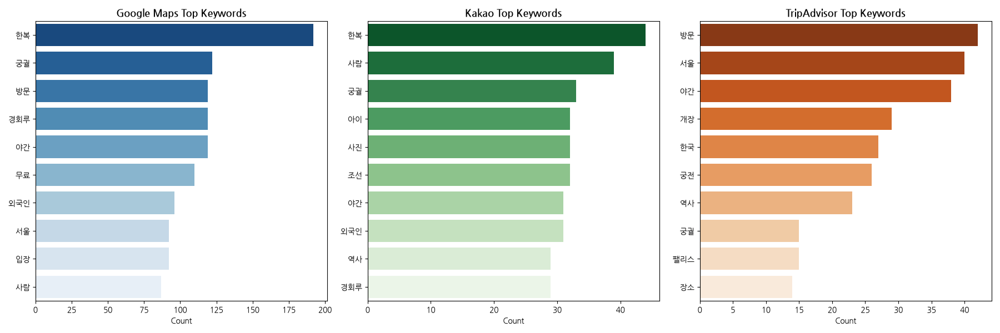

 각 사이트에서 주요한 키워드를 단어 빈도수를 통해 확인해보았다. 대명사나 의존명사, 경복궁처럼 주는 정보가 적고 많이 나오는 단어들은 불용어 처리를 해서 의미있는 단어들을 중심으로 살펴보았다. 구글맵과 카카오맵 리뷰에서는 '한복' 키워드가 가장 높게 나왔다. 그리고 세 사이트 모두 '야간'이라는 단어의 빈도수가 높은 것을 확인했다. 이외에 구글맵에는 '경회루', '무료'와 같은 단어가 많이 등장했고 카카오맵에는 '아이', '사진', 트립어드바이저에서는 '서울', '한국', '역사'와 같은 단어의 빈도수가 높았다.

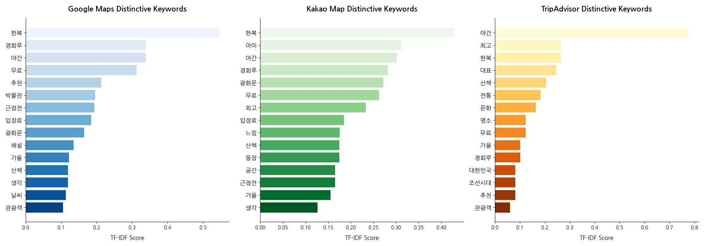
 각 사이트의 리뷰 특징을 좀 더 명확하게 비교하기 위해 단순한 단어 빈도수 분석 이에외도 TF-IDF 분석을 추가로 진행했다. 이를 통해 각 사이트별로 어떤 단어들이 유독 많이 나오는지를 확인할 수 있었다. 마찬가지로 대명사나 의존명사, 경복궁처럼 주는 정보가 적고 많이 나오는 단어들은 불용어 처리를 했고 각 사이트별 tf-idf 스코어가 높은 단어 15개를 출력했다. 

 #### 키워드 분석을 통한 플랫폼별 주요 특징
 1. 구글맵 - 실용적인 관람정보 중심
 단어 빈도수 분석에서는 '한복', '궁궐', '경회루' 등 전통적인 명칭이 높게 나타났으나, TF-IDF 분석에서 '무료','입장료'와 '박물관', '해설' 같은 키워드들이 두드러졌다.
 -> 구글맵 사용자들은 비용('입장료', '무료')과 관람 편의('해설','박물관') 등 실용적인 정보를 공유하는 경향이 뚜렷하다.

 2. 카카오맵 - 가족과 분위기 중심
 단어 빈도수 분석과 TF-IDF 모두에서 '아이' 키워드가 높게 나타났다. 또한 다른 사이트보다 '산책', '느낌', '웅장', '공간' 등 공간이 주는 감상과 분위기를 표현하는 키워드가 많았다.
 -> 카카오맵은 국내 이용자가 많은 플랫폼의 특성상 가족 단위의 방문객이 많았고 공간의 감상과 분위기를 중시하는 경향이 뚜렷하다.

 3. 트립어드바이저 - 전통 관광지
 '야간' 키워드가 압도적으로 높은 TF-IDF 점수를 받았다.'대표', '전통', '문화', '명소', '대한민국', '조선시대', '관광객' 등 국가적·문화적 가치와 관련된 단어들이 골고루 분포했다.
 -> 글로벌 및 여행 전문 플랫폼인만큼 경복궁을 단순한 산책로나 일상적 공간보다는 관광지의 관점에서 한국을 대표하는 전통 문화 명소이자 야간 관람 코스로 바라보는 사람들이 많다.

# [4회차] GitHub 협업과제

## 1. 팀 소개
저희 8조는 Web, 리뷰 데이터 크롤링, EDA 및 Feature Engineering 과제를 함께 수행했습니다. GitHub의 브랜치 보호 규칙과 Pull Request, 코드 리뷰 과정을 적용하여 협업을 진행했습니다.
### 1.1 팀원 자기소개

- 22학번 컴퓨터과학과 01년생 설승곤입니다.
- 24학번 산업공학과 04년생 김서영입니다.
- 22학번 산업공학과 03년생 임정찬입니다.

---

## 2. GitHub 협업 과정

### 2.1 Branch Protection Rule

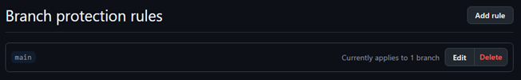

### 2.2 Main 브랜치 Push 거부

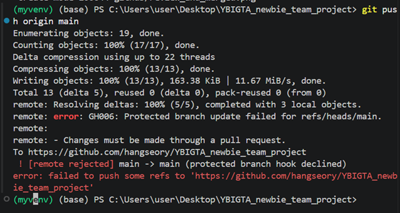

### 2.3 Pull Request, Review 및 Merge

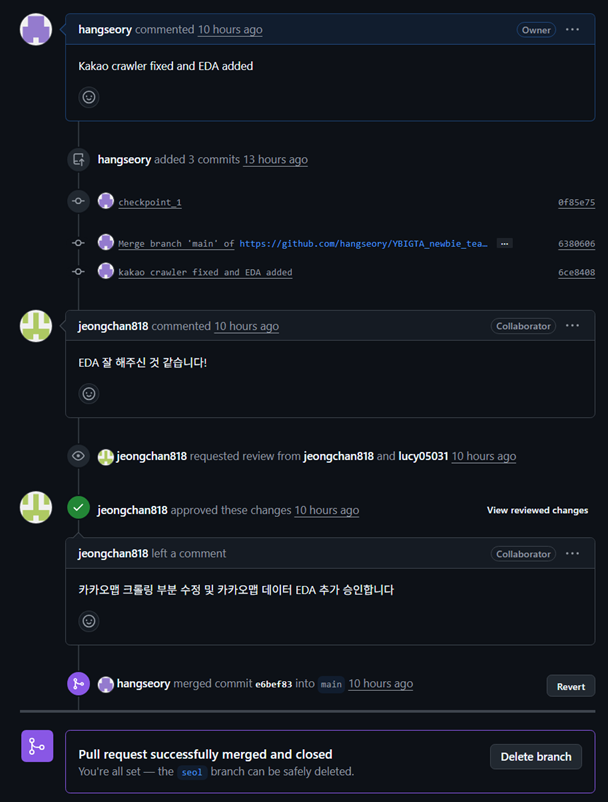

---

## 3. 과제 실행 방법

### 3.1 패키지 설치

```bash
python -m pip install -r requirements.txt
```

### 3.2 Web 과제 실행

```bash
uvicorn app.main:app --reload
```

```bash
pytest
```

```bash
mypy app/
```

### 3.3 크롤링 과제 실행

#### 카카오맵

```bash
python -m review_analysis.crawling.main -o database -c kakao
```

#### 트립어드바이저

```bash
python -m review_analysis.crawling.main -o database -c tripadvisor
```

#### 구글맵

```bash
python -m review_analysis.crawling.main -o database -c googlemaps
```

#### 전체 크롤링

```bash
python -m review_analysis.crawling.main -o database --all
```

#### 타입 검사

```bash
python -m mypy review_analysis utils
```

### 3.4 EDA 실행

#### 카카오맵

```bash
python review_analysis/plots/visual_kakao.py
```

#### 트립어드바이저

```bash
python review_analysis/eda_tripadvisor.py
```

#### 구글맵

```bash
python review_analysis/plots/visual_google.py
```

### 3.5 전처리 및 Feature Engineering 실행

```bash
python main.py --output_dir ../../database --all
```

## Docker Hub
https://hub.docker.com/r/seoo0/ybigta-backend

## aws 수행 사진

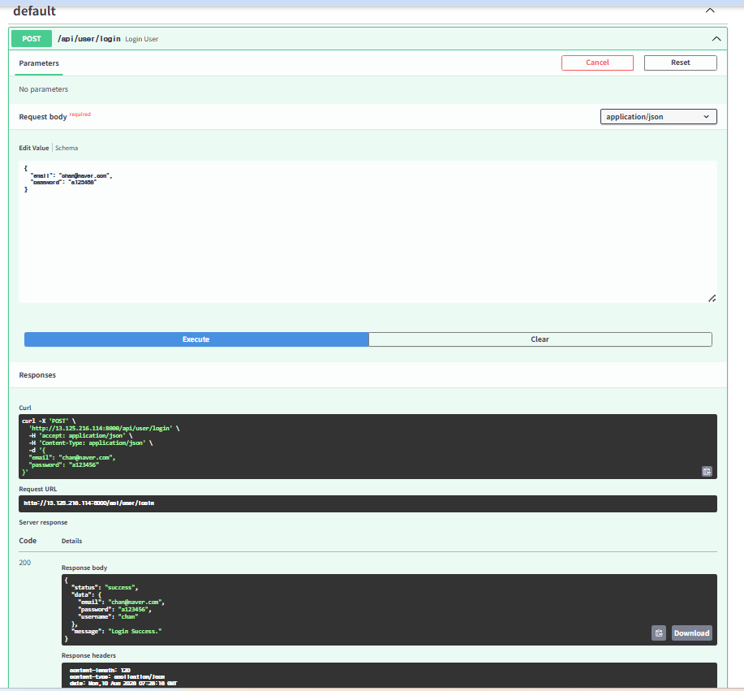
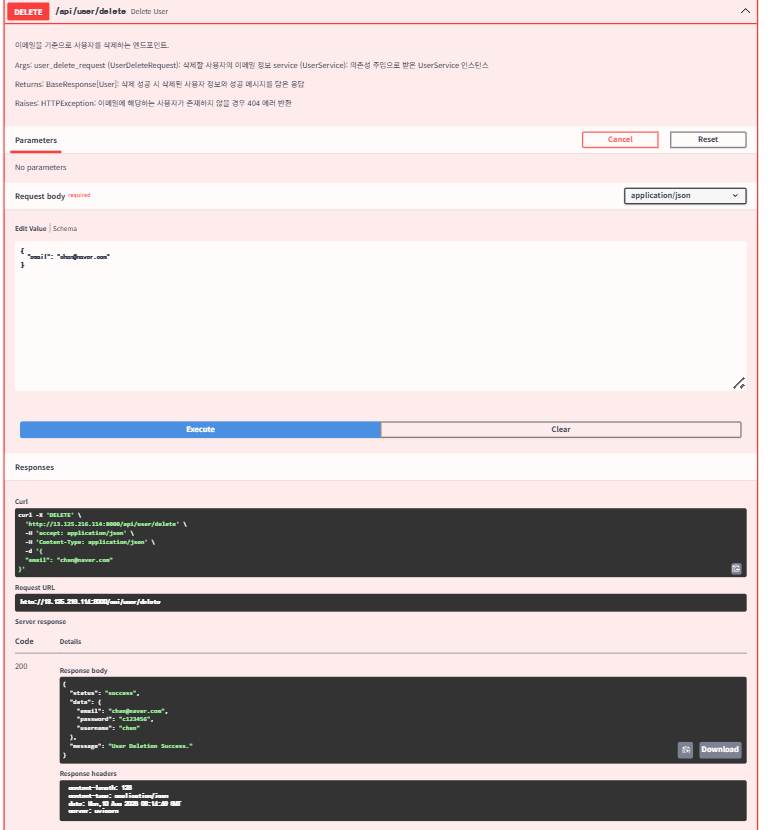
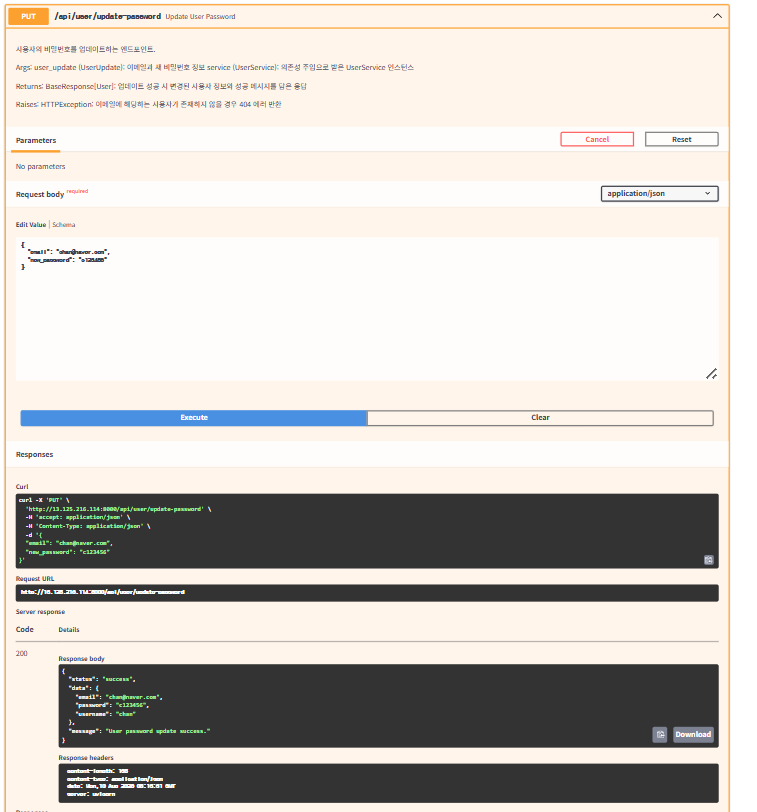
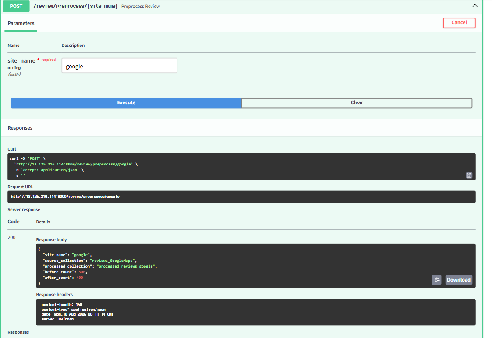
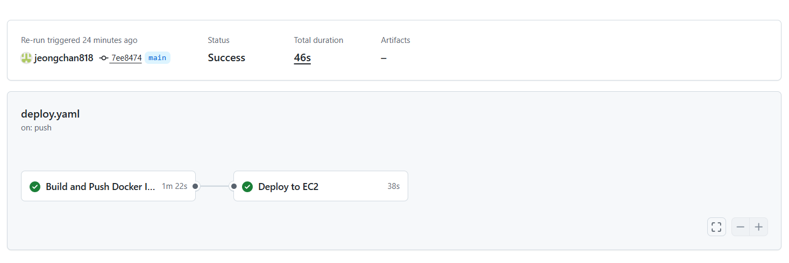


## RDS 퍼블릭 엑세스를 허용하지 않고, VPC를 활용하여 보안 설정하기

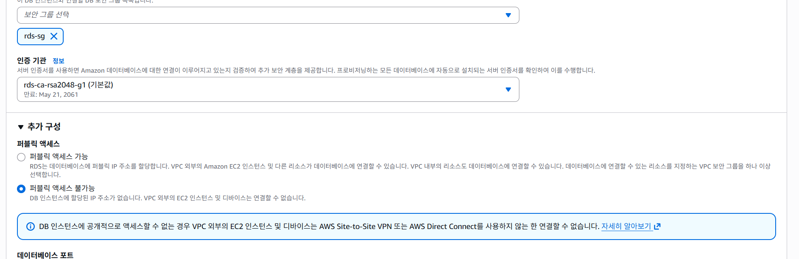
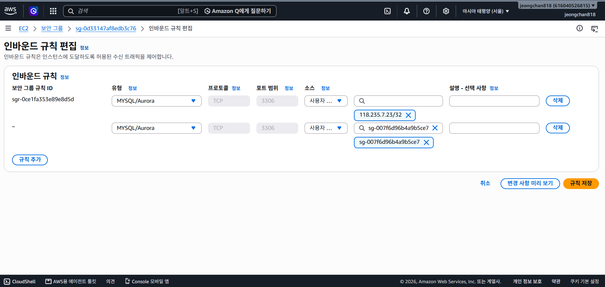

# AI Agent

## 1. 데이터 파이프라인

### 1. 데이터 수집

- 데이터: 카카오맵 경복궁 리뷰 (https://place.map.kakao.com/18619553#review)
- 저장 컬럼: `rating`(별점), `review_date`(작성일, `YYYY-MM-DD`), `review`(리뷰 내용), `review_length`(리뷰 글자 수)
- 시간 정보: `created_at`(최초 저장 시각), `updated_at`(마지막 수정 시각), `collected_at`(마지막으로 수집기가 이 리뷰를 확인한 시각)

### 2. 수집 간격

- **30분 간격**으로 자동 수집
- 매 실행마다 최신 리뷰 최대 50개를 확인하며, 이미 저장된 리뷰(rating+날짜+내용 해시로 판별)는 새로 추가하지 않고 `collected_at`만 갱신. 새 리뷰만 새 행으로 추가
- 최초 1회는 과거 리뷰까지 폭넓게 확보하기 위해 약 300여 개를 수동으로 수집.

### 3. AWS 기능

- **EC2**(Amazon Linux 2023, t3.small): `collector/` 코드를 systemd timer로 30분마다 자동 실행
- **RDS(MySQL)**: 수집한 데이터 저장소, Private Subnet에 위치, Public Access 비활성화

### 자동 갱신 증빙자료

같은 EC2에서 자동으로 데이터가 수집되고 갱신된 것을 보여주는 캡처(16:26은 최초 데이터 저장 시각)

- 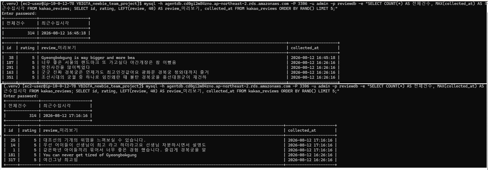 

30분동안 새로운 리뷰가 없어서 리뷰 건수는 같다.

## 2. DB / VPC 구조

```
VPC (agent-vpc)
├── Public Subnet
│   └── EC2 (Security Group: mcp-sg) — collector 실행 + (추후) MCP Server
└── Private Subnet
    └── RDS MySQL: agentdb / reviewdb (Security Group: rds-sg)
```

- RDS는 **Public Access 비활성화** 상태로 Private Subnet에 위치해, 외부 인터넷에서 직접 접근 불가능
- RDS Security Group(`rds-sg`)의 인바운드는 `3306 ← mcp-sg`로만 허용해, `mcp-sg`가 붙은 EC2를 통해서만 접근 가능
- DB 계정을 역할별로 분리
  - `collector_user`: `kakao_reviews` 테이블에 대해 SELECT/INSERT/UPDATE만 가능 (수집기 전용)
  - `mcp_user`: DB 전체에 대해 SELECT만 가능 (MCP 서버 전용, read-only)
- 테이블/계정 정의는 [`collector/schema.sql`](collector/schema.sql)에서 확인 가능

## 3. MCP

> TODO: MCP 서버 담당 팀원 작성

Agent가 사용할 수 있도록 아래 3개의 데이터 조회 Tool을 제공할 예정입니다.

| Tool 이름 | 설명 | 파라미터 |
|---|---|---|
| `get_latest_reviews` | 가장 최근 작성된 리뷰 목록 조회 | `limit` (선택) |
| `search_reviews` | 키워드 기반 리뷰 검색 (기간 필터 가능) | `keyword` (필수), `start_date`, `end_date`, `limit` (선택) |
| `aggregate_ratings` | 특정 기간의 평균 별점 및 리뷰 개수 집계 | `start_date`, `end_date` (필수) |

Raw SQL을 직접 실행하는 Tool은 만들지 않고, 파라미터를 제한된 형태로만 받아 안전성을 확보하는 방향으로 설계했습니다.

## 4. MCP 보안

> TODO: MCP 서버 담당 팀원 작성

- MCP 요청에 `Authorization: Bearer <MCP_AUTH_TOKEN>` 인증을 적용합니다.
- MCP가 사용하는 DB 계정(`mcp_user`)은 read-only 권한만 가집니다.
- MCP 서버의 내부 포트를 인터넷에 직접 노출하지 않고 Reverse Proxy를 통해서만 접근 가능하도록 구성할 예정입니다.

## 5. Data Analysis Agent

Vercel + Next.js로 구현한 채팅 기반 Agent입니다. 사용자가 자연어로 질문하면, Agent가 MCP Tool을 스스로 선택해 호출하고 그 결과를 바탕으로 답변을 생성합니다.

### 구조
사용자 질문
↓
Agent (Google Gemini, Function Calling)
↓
MCP Tool 선택 (get_latest_reviews / search_reviews / aggregate_ratings)
↓
MCP Server 호출
↓
DB (kakao_reviews) 조회
↓
MCP Result → Agent
↓
Agent가 결과를 바탕으로 자연어 답변 생성

Gemini의 Function Calling 기능을 사용해 사용자의 질문 의도를 분석하고, 필요한 MCP Tool을 스스로 선택해 호출합니다. 하나의 질문에 여러 번의 Tool 호출이 필요한 경우(예: 최신 데이터 확인 후 집계 계산)에도 최대 5턴까지 반복 호출을 지원하도록 구현했습니다.

### 보안

- LLM API Key(`GEMINI_API_KEY`), MCP 인증 토큰(`MCP_AUTH_TOKEN`) 등은 모두 서버 사이드(`app/api/chat/route.ts`)에서만 사용하며, `NEXT_PUBLIC_` 접두사를 사용하지 않아 Client Bundle에 노출되지 않습니다.
- 브라우저(Client Component)는 MCP 서버 주소나 인증 토큰을 전혀 알지 못하며, MCP 호출은 반드시 Next.js 서버를 거칩니다.

### 실행 방법

```bash
cd web
npm install
npm run dev
```

`http://localhost:3000` 에서 확인 가능합니다.

환경변수는 `web/.env.example` 참고:

```env
GEMINI_API_KEY=
MCP_SERVER_URL=
MCP_AUTH_TOKEN=
```

## 6. Agent 동작 확인

### 단순 조회

> 질문: "가장 최근 리뷰 알려줘"
> → `get_latest_reviews` Tool 호출 → 최근 리뷰 목록을 바탕으로 답변 생성

### 분석/집계

> 질문: "이번 주 평균 별점 알려줘"
> → `aggregate_ratings(start_date, end_date)` Tool 호출 → 평균 별점과 리뷰 건수를 바탕으로 답변 생성

(스크린샷: `aws/agent_query.png`, `aws/agent_analysis.png`)


